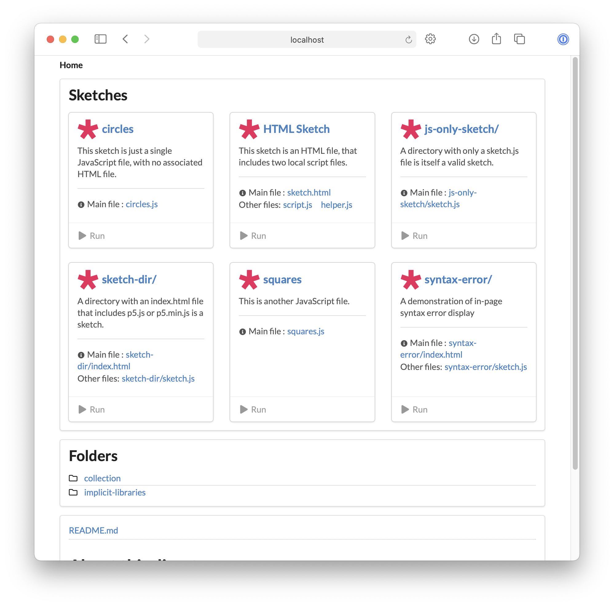

# p5-server

Launch a local developer server that knows about
[p5.js](https://p5js.org/libraries/) sketches.



## Features

* **Live reload**. The browser reloads the page, when any file in its directory is
  modified.
* **JavaScript-only sketches**. Run a sketch that's just a JavaScript file (e.g.
  `p5 serve sketch.js`). You don't need to create an HTML wrapper.
* **Automatic library includes**. If the server detects that a JavaScript-only
  sketch requires a [p5.js library](https://p5js.org/libraries/), it will
  automatically include it. (See
  [here](https://github.com/osteele/p5-server#automatic-library-inclusion) for
  how this works.)
* **In-Page syntax errors**. If a JavaScript file has a syntax error, it is
  displayed in the body of the page (you don't have to check the console).
* **P5-aware directory listings**. Viewing a directory in the browser lists the
  sketches, folders, other files in that directory.
* **Create scripts from templates**.

## Install

Follow the instructions in the
[Marketplace](https://marketplace.visualstudio.com/items?itemName=osteele.p5-server),
or run the following in the command palette:

```sh
ext install osteele.p5-server
```

## Usage

It adds these commands to the command palette:

```text
'P5 Server: Start' // Start the P5 server
'P5 Server: Stop' // Stop the P5 server
'P5 Server: Open In Browser' // Open the p5 server URL in a browser
'Create p5.js Sketch File' // Create a new p5.js JavaScript sketch file
'Create p5.js Sketch Folder' // Create a new folder with a p5.js index.html and a sketch.js file
```

## Planned Features

* Add a UI for customizing generated sketches, using the options in [p5-server](https://github.com/osteele/p5-server#p5-create-sketch-name---no-html).

## Technical Notes

The sketch analysis, library inference, and server features are provided by
[p5-server](https://github.com/osteele/p5-server) library. That library provides
much of the same functionality as this extension, via the command-line. See its
documentation for [implementation
notes](https://github.com/osteele/p5-server#implementation-notes) and
[limitations](https://github.com/osteele/p5-server#limitations).

## Acknowledgements

* Heavily inspired by Ritwick Dey's fantastic [Live Server
  extension](https://ritwickdey.github.io/vscode-live-server/). This extension
  [does more](#features) for p5.js sketches, but does not implement Live
  Server's [extensive list of features for general web
  development](https://github.com/ritwickdey/vscode-live-server#features).
* Uses [open](https://github.com/sindresorhus/open#readme)

## License

MIT © Oliver Steele
