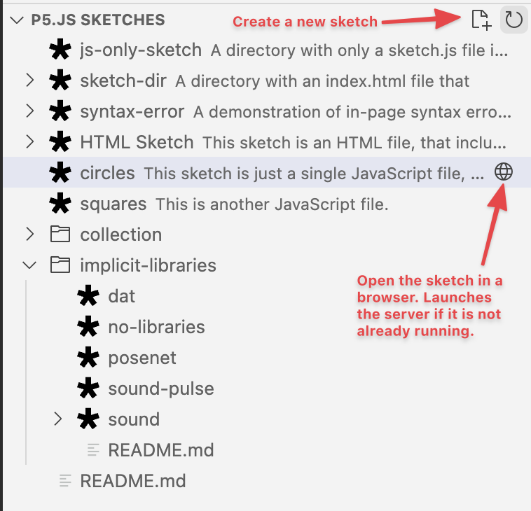

# p5-server

Launch a local developer server that knows about
[p5.js](https://p5js.org/libraries/) sketches.


An explorer view shows the sketches in the current workspace.



The status bar icons can be used to start and stop the server (✮5 Server), and
open the server root in the browser (🌐P5 Browser).


## Features

* **Live reload**. The browser reloads the page, when any file in its directory is
  modified.
* **JavaScript-only sketches**. Run a sketch that's just a JavaScript file (e.g.
  `sketch.js`). You don't need to create an HTML wrapper.
* **Automatic library includes**. If the server detects that a JavaScript-only
  sketch requires a [p5.js library](https://p5js.org/libraries/), it will
  automatically include it. (See
  [here](https://github.com/osteele/p5-server#automatic-library-inclusion) for
  how this works.)
* **In-Page syntax errors**. If a JavaScript file has a syntax error, it is
  displayed in the body of the page (you don't have to check the console).
* **P5-aware directory listings**. Viewing a directory in the browser lists the
  sketches, folders, other files in that directory.
* **Sketch scripts generation**. Create a JavaScript-only sketch that contains a
  minimal `setup()` and `draw()` function; or create a pair of `index.html` and
  `sketch.js`.
* **Sketch explorer**. A view of the sketches in the current workspace.

## Usage

It adds these commands to the command palette:

```text
'P5 Server: Start' // Start the P5 server
'P5 Server: Stop' // Stop the P5 server
'P5 Server: Open In Browser' // Open the p5 server URL in a browser
'Create p5.js Sketch File' // Create a new p5.js JavaScript sketch file
'Create p5.js Sketch Folder' // Create a new folder with a p5.js index.html and a sketch.js file
```

## Limitations

See the [p5-server
documentation](https://github.com/osteele/p5-server#limitations) for limitations
that also affect this extension.

In particular, this code has not been tested on Windows.

## Install

Follow the instructions in the
[Marketplace](https://marketplace.visualstudio.com/items?itemName=osteele.p5-server),
or run the following in the command palette:

```sh
ext install osteele.p5-server
```

## Configuration

The extension provides configuration settings to set the browser, and to hide
various user interface elements. Follow [these
instructions](https://code.visualstudio.com/docs/getstarted/settings) to modify
these settings.

## Technical Notes

The [p5-server](https://github.com/osteele/p5-server) companion project provides
the sketch analysis, library inference, and server features used by this
extension. See that package's [implementation
notes](https://github.com/osteele/p5-server#implementation-notes) for
documentation about how sketches are recognized and how library inference works.

## Acknowledgements

* The functionality and user interface of this extension were heavily inspired
  by Ritwick Dey's fantastic [Live Server
  extension](https://ritwickdey.github.io/vscode-live-server/). This extension
  [does more](#features) for p5.js sketches, but it does not implement Live
  Server's [extensive list of features for general web
  development](https://github.com/ritwickdey/vscode-live-server#features).
* The extension uses the [open](https://github.com/sindresorhus/open#readme)
  package to open URL's in the browser.
* I learned a lot from reading the source code to the [vscode-project-manager
  extension](https://github.com/alefragnani/vscode-project-manager).

## License

[MIT](LICENSE) © by Oliver Steele
