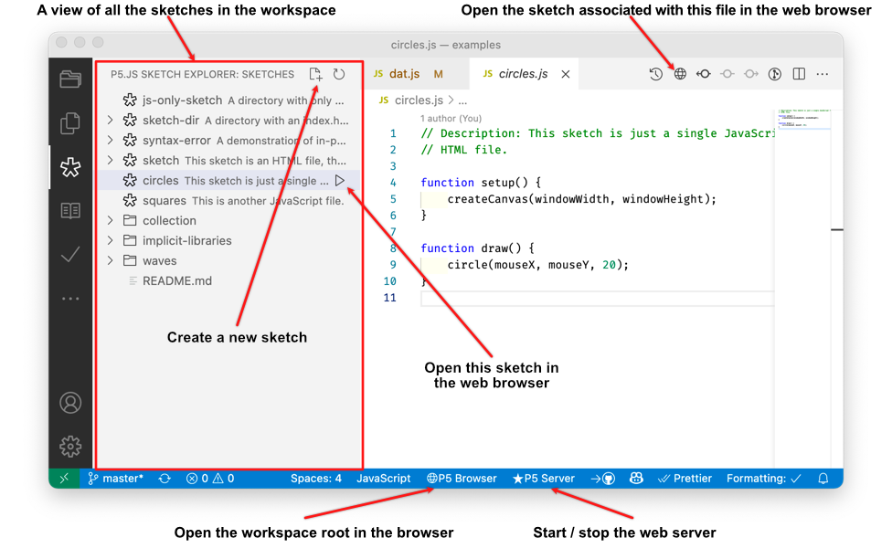

# p5-server

[](https://marketplace.visualstudio.com/items?itemName=osteele.p5-server)

> Create and run p5.js sketches, explore sketch collections. Includes a
> sketch-aware development server with live reload; a sketch explorer; and
> support for JavaScript-only sketches with automatic library inclusion.

## Features

### Sketch Explorer


The Sketch Explorer is similar to Visual Studio Code's built-in Explorer, but
the Sketch Explorer is organized around sketches instead of files. It supports
both sketches that are included in HTML files, and JavaScript-only sketches
(that don't have an HTML file).


Clicking on a sketch in the Sketch Explorer opens its JavaScript file in the
Visual Studio Code editor.

### Integrated Web Server



The extension includes a local web server. This server reloads sketches when
files are modified. It also serves JavaScript-only sketches in a way that the
browser can play.

### Integrated Browser

The Run Sketch command can open the sketch in an external web browser (such as
Chrome, Safari, or Edge), or in an *integrated browser* inside Visual Studio
Code. (The "P5-server: Browser" setting controls this.)

If the "P5-server > Explorer: Auto Run Sketch On Side" setting is enabled,
clicking on a sketch in the Sketch Explorer also runs it next to the editor.
This makes it easy to quickly browse a collection of sketches.

<!--  -->


### Integrated Console


When the "P5-server: Browser" setting is set to `integrated`, messages from
`console.log()` and other console output will display in the output pane. These
messages also appear inline in the JavaScript source file.

The console output pane automatically appears when a message is printed to it.
This behavior can be changed via the "Console > Integrated Browser > Auto Show:
Level" setting.

### Automatic Library Includes

If a JavaScript-only sketch uses a class or function from one of the [p5.js
community libraries](https://p5js.org/libraries/), or from [my own library
collection](https://osteele.github.io/p5.libs/), that library is automatically
included.

In the screenshot below, the extension infers that the `sound.js` sketch
requires the p5.sound library, because of the presence of a call to
`loadSound()`. Running the sketch will include this library.

The explorer also detects that the file `doorbell.mp3` is associated with the
sketch, because it's the argument to the p5.js function `loadSound()`.


### Other Features

* **JavaScript-Only Sketches**. A sketch can be a single JavaScript file. (No HTML is necessary.)
* **In-Page syntax errors**. If a JavaScript file has a syntax error, it is
  displayed in the body of the page (you don't have to check the console).
* **P5-aware directory listings**. Viewing a directory in the browser lists the
  sketches, folders, other files in that directory.
* **Sketch scripts generation**. Create a JavaScript-only sketch that contains a
  minimal `setup()` and `draw()` function; or create a pair of `index.html` and
  `sketch.js`.

## Installation

Follow the instructions in the
[Visual Studio Code Marketplace](https://marketplace.visualstudio.com/items?itemName=osteele.p5-server).

## Usage

The extension adds these commands to the command palette:

```text
'P5 Server: Start' // Start the P5 server
'P5 Server: Stop' // Stop the P5 server
'P5 Server: Open In Browser' // Open the p5 server URL in a browser
'Create p5.js Sketch File' // Create a new p5.js JavaScript sketch file
'Create p5.js Sketch Folder' // Create a new folder with a p5.js index.html and a sketch.js file
```

## Configuration

The extension provides configuration settings to set the browser, and to hide
various user interface elements. Follow [these
instructions](https://code.visualstudio.com/docs/getstarted/settings) to modify
these settings.


## Limitations

See the [p5-server
documentation](https://github.com/osteele/p5-server#limitations) for limitations
that also affect this extension.

In particular:

* The extension has not been tested on Windows.
* The sketches that are created by the “Create p5.js Sketch Folder” command
  require an internet connection to run. (They load the p5.js and other libraries
  from a content delivery network, or “CDN”.) Browsers cache these files, so
  reloading a page or running other sketches that use the same libraries
  does not require additional internet access, but you will need internet access
  the first time you use this extension or after the browser cache has expired.
* Similarly, the server requires an internet connection the first time it
  displays a sketch or directory listing. (It does not need a connection to
  display a second sketch or a second directory listing, unless the browser
  cache has expired.)

## Related Projects

The sketch-aware server is available as command-line tool at
[p5-server](https://osteele.github.io/p5-server/). Install it via `npm install
-g p5-server`, and run `p5 serve` or `p5 serve --template split`.

The command-line version can also be used to generate a static web site. This
creates the HTML files that are necessary to run the sketch in a browser without
a special server.

The code to infer libraries from JavaScript-only sketches, and to generate HTML
files based on this, is available as a [separate
package](https://osteele.github.io/p5-server/p5-analysis/).

## Keeping in Touch

Bug reports, suggestions, and other contributions are cheerfully accepted.
Please use the [Issues page of the GitHub
repository](https://github.com/osteele/vscode-p5server/issues).

[Follow me on Twitter](https://twitter.com/osteele) to keep up with this project
and related projects.

## Acknowledgements

* The functionality and user interface of this extension were heavily inspired
  by Ritwick Dey's fantastic [Live Server
  extension](https://ritwickdey.github.io/vscode-live-server/). My own extension
  (p5 server) [does more](#features) for p5.js sketches, but it does not
  implement Live Server's [extensive list of features for general web
  development](https://github.com/ritwickdey/vscode-live-server#features).
* The [open](https://github.com/sindresorhus/open#readme) package is used to
  open URL's in various browsers.
* I learned a lot from reading the source code to the [vscode-project-manager
  extension](https://github.com/alefragnani/vscode-project-manager).

## License

[MIT](LICENSE) © by Oliver Steele
